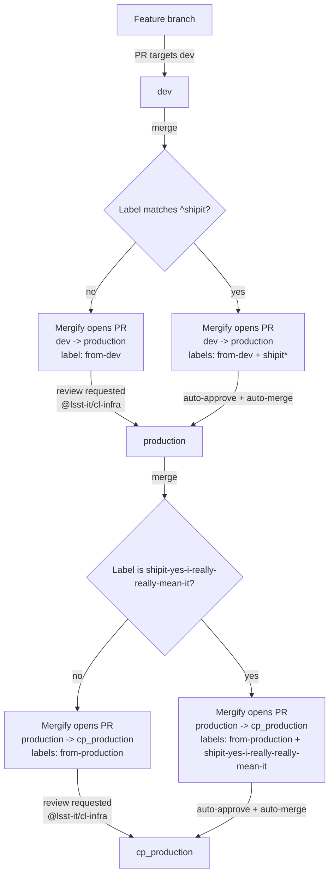

# k8s cookbook

## Merge & Promotion Workflow (dev -> production -> cp_production)

This repository uses a gated promotion workflow enforced by Pull Requests (PRs) and automated by **Mergify**.

Primary branches:

- `dev` — integration branch; **all changes must land here first**
- `production` — promoted from `dev`
- `cp_production` — promoted from `production`

> **Golden rule:** Do not open PRs directly to `production` or `cp_production` for normal work. Always start with a PR into `dev`.

---

### Promotion/backport PRs

When a PR is merged into a primary branch, Mergify will automatically create promotion/backport PRs and apply labels:

- Promotion PRs from `dev` are labeled: `from-dev`
- Promotion PRs from `production` are labeled: `from-production`

Mergify will request reviews from `@lsst-it/cl-infra` unless the PR has a fast-track label applied to it (see below).

---

### Fast-track Labels

There are two fast-track labels that may be applied to the **original PR into `dev`**.
These labels are intended as a short-cut to reduce repetiive manual steps for changes that need to be rolled out immediately and/or can not be practically tested in the `dev` environment.

- `shipit`: Mergify opens a PR to `production` and **auto-merges it**.  A PR to `cp_production` will be opened but **will not be auto-merged**
- `shipit-yes-i-really-really-mean-it`: Mergify opens a PR to `production` and **auto-merges it**, then it opens a PR to `cp_production` and **auto-merges it**

---

### Workflow Diagram

